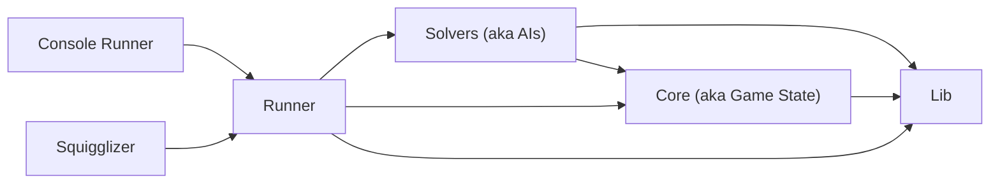

# The Cat is #1!! ICFP 202X (Template)

A template for future ICFP repositories.

## Generate New Repo

Click the "Use this template" button when viewing in Github. This will generate a copy of this template as a new repository.

- The repository will be immediately usable.
- Any classes or projects that are not needed can be deleted or ignored.
- Some classes are available in `int`/`double` variants. (eg. `PointInt` and `PointDouble`). If the problem requires, say, `PointInt`, then best practice is to delete `PointDouble` and rename `PointInt` to `Point`.

## Running it

### Console-based

Within Visual Studio

- Right-click on ConsoleRunner project -> Set as Startup Project
- In Menu, Debug -> ConsoleRunner Debug Properties
  - In Command line arguments textbox, provide the arguments you want to pass. eg. `--solver ExampleSolver`
- F5 to run

### Squigglizer-based

Within Visual Studio

- Right-click on Squigglizer project -> Set as Startup Project
- F5 to run

## Architecture

The solution is organized after a common architecture we have used in the past.

The **Console Runner** is a thin client for running the program in the console. It is little more than an EXE shim over the code in the Runner library. It is used primarily for batch runs or prior to the Squigglizer being functional. `Program` is the entry point for this project.

The **Squigglizer** is a thick client that visualizes the output of the program and offers much more control for debugging. It uses the capabilities of the Runner library to the fullest. This is the primary tool for development.

The **Runner** library controls the state running the program. It loads problems, instantiates the Solver(s) and the Core state, and controls the progress through the run (eg. looping through a batch of problems, stepping through turns in a game, etc). `Run` is the entry point for this library.

The **Solvers** library contains the individual problem solving logics. They take the current Core state and return the next step (eg. next move in a game or sub-solution to a problem). This library end up containing many solvers as we explore different strategies. `Catalog` is the entry point for this library.

The **Core** library controls the state of the thing being solved. It contains the current state of the game or problem, and the logic for updating that state. `Assignment` is the entry point for this library.

The **Lib** library contains common utilities and data structures used by the other libraries.

## Details

### Console Runner

`Args` defines which console arguments are recognized and available to the Console Runner. Any arguments not defined here will be passed on to the Solver as strings.

`RunLogger` is the `ILogger` implementation for this EXE. It simply logs to the console.

### Squigglizer

The Squigglizer has three panes:

- A canvas for rendering the assignment
- A console area for logging.
- A control area for buttons etc

`ConsoleControl` is the `ILogger` implementation for this EXE. It logs to the console pane.

### Runner

The Runner is the orchestrator of the program. It instantiates the Solver(s), creates the Assignment core state, and starts the Solver with that assignment.

This is a common place for things to shift around depending on the competition. Sometimes the solver takes the core state, sometimes the core state takes the solver, sometimes the runner needs to keep them separate and perform a more complex orchestration.

### Solvers

`Catalog` uses reflection to dynamically determine and instantiate from the available solvers. It works with any class that extends the abstract `Solver`.

All solvers have access to solver-specific arguments provided during creation, as well as an `ILogger` instance to provide logging to either the console or visualizer.

An `ExampleSolver` implementation is provided for the example problem.

### Core

An example `Assignment` is provided for the example problem. It also has access to the `ILogger`.

### Lib

This is an accumulation of things we've used in the past that are likely to be useful in the future. It contains common utilities and data structures.

Drawing / Geometry

- `BoxDouble` and `BoxInt`: Represents a rectangle.
- `Color`: Represents a color with byte-precision RGBA values.
- `Image`: Represents an pixel-grid image with byte-precision colors.
- `PointDouble` and `PointInt`: Represents a point.
- `Vec`: Represents a 2D vector with double-precision coordinates.

Other

- `Cache`: For complicated caching during performance optimization
- `FileUtil`: Utility class for reading and writing files, with relative pathing based on the repository root.
- `Finder`: Finds files and directories.
- `ILogger`: A shared logging interface to separate the act of logging a value from the act of displaying it.
- `RestConnector`: Utility class for making REST requests.
